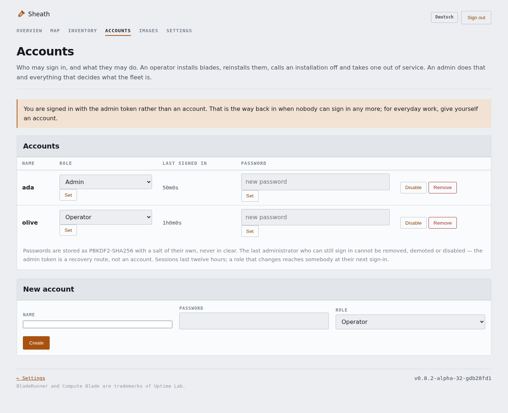

# Sheath

Management for [Compute Blades](https://docs.computeblade.com/) in BladeRunner chassis.

> **Not the official one** — Uptime Lab, who make the Compute Blade, are
> building **Orchestrator**: a platform for provisioning and managing clusters
> of nodes, bare metal and virtual machines as well as Raspberry Pi fleets. Its
> public issue tracker is at
> [uptime-lab/orchestrator-tracker](https://github.com/uptime-lab/orchestrator-tracker),
> and if you are looking for a supported product, look there.
>
> Sheath is a **proof of concept** for one particular rack: the local
> environment of [Panxatony](https://github.com/Panxatony), two sites and a
> dozen blades. It exists because that environment had questions worth
> answering in code, and everything in it was tried on that hardware. It is
> not a product, it carries no promise of support, and it is published in case
> the answers are useful to somebody else.

> **How this was built** — the code in this repository was written by
> [Claude](https://claude.com/claude-code) (Anthropic), working from the ideas,
> the design decisions and the review of [Panxatony](https://github.com/Panxatony),
> whose rack it runs on. What to build, which trade-offs to accept and what
> counts as finished came from there; so did every correction that mattered.
> Nothing here is a sketch: each part was tried on the hardware before it was
> called done.

Slot in an empty blade, pick an image in the interface — Sheath does the rest:
netboot, write the image to the NVMe, seed credentials and the agent, hand out a
fixed address, and watch it from then on.

## What it looks like

The overview: every site, every BladeRunner, every slot as one square — green
where a blade is in sync, amber where something wants looking at, hatched where
the slot is empty.

<a href="docs/img/overview.png"></a>

One BladeRunner: what sits in each slot, which distribution it runs, how warm it
is, what its fan is doing, and underneath it what the blades in this enclosure
have been up to.

<a href="docs/img/bladerunner.png"></a>

The inventory: what is screwed into the racks across every site. The module and
its revision, the memory, an eMMC or a card told apart by name and size, the
NVMe, the bootloader, the boot order read out of the EEPROM, how each blade came
up this time, and whether anybody could get a shell on it. It is read from the revision
code the firmware leaves in the OTP and from the device tree — and the mini OS
reads it too, so a blade waiting for someone to choose an image already says
what it is.

<a href="docs/img/inventory.png"></a>

Accounts and two roles: an operator installs blades, reinstalls them, calls an
installation off and takes one out of service. An admin does that and
everything that decides what the fleet is.

<a href="docs/img/accounts.png"></a>

The pictures are shown small; click one for the full view. They come from a
demonstration instance with invented blades — the addresses, serial numbers and
names in them belong to nothing.

## What it does

| Pillar | |
|---|---|
| **Provision** | Netboot into a mini OS that writes the assigned image to the NVMe, the eMMC or a card |
| **Configure** | The agent pulls its desired state every 60 s and applies it idempotently |
| **Address** | DHCP reservations from the inventory; netboot switchable per blade |
| **Monitor** | Temperatures, fan, throttling, disk usage — seen from inside and outside, and said out loud by mail when a blade stays unwell |
| **Account** | What is in the racks: module and revision, memory, storage, firmware — read by the mini OS before an image is even chosen |
| **Reinstall** | Assign a different image, request installation, restart the blade |
| **Who** | Accounts with two roles: an operator works at the rack, an admin decides what the fleet is — and the log says which of them did it |

Several distributions run side by side: the distribution is an attribute of the
blade, not a build process. Ubuntu, Debian, DietPi and Raspberry Pi OS share the
same flow.

One caveat worth knowing before choosing: the bootloader reads a GPT from an
NVMe and not from an eMMC or a card. An image that carries one — Debian's own
raspi image does — writes onto a card perfectly well and then boots from
nowhere. Sheath reads the partition table of every image it mirrors and refuses
that pairing before the hour of writing rather than after it. Raspberry Pi OS
Lite is Debian Trixie with a plain MBR, so it boots from every device a blade
has.

## Layout

```
server/      Go, SQLite, web interface and REST API      → /srv/sheath/sheathd
site/        Go, one per site: DHCP reservations,        → /usr/local/bin/sheath-site
             netboot detection, image cache, relay
agent/       Go, runs on every blade                     → /usr/local/bin/sheath-agent
installer/   Go, runs in the mini OS during netboot      → inside boot.img
tools/       mirror and prepare images; build the mini OS and the netboot payload
deploy/      Ansible: the centre and the sites, from a release or a local build
assets/      Mark (SVG)
docs/        architecture, installation, screenshots
```

Alongside those: `docs/ARCHITECTURE.md` (why it is built this way),
`docs/ARCHITECTURE-SITES.md` (what a site is and what it may decide alone) and
`docs/INSTALLATION.md` (how to install it on the metal, including the traps
that went off along the way).

## More than one site

A site is one broadcast domain with a machine in it. `sheath-site` runs there
and is the only thing the blades of that site talk to: it writes the DHCP
reservations, holds the images and the payload, and answers its blades from
that cache while the centre is unreachable. The centre keeps the inventory and
the decisions and never touches a wire.

A new site signs itself in with a one-time code from the interface — the token
is written on the site machine and never travels through a terminal history:

```sh
sheath-site --server http://sheath-server:8080 --enroll ABCD-EFGH-JKLM
```

## Deploying

```sh
cd deploy
cp inventory.example.ini inventory.ini      # and edit it
ansible-playbook site.yml --check --diff    # look first
ansible-playbook site.yml -e sheath_version=v0.8.2-alpha
```

Two roles, one for the centre and one for a site. Binaries come from a release
or, with `sheath_local_bin_dir`, from a build of your own. DHCP is off unless
you ask for it: a second DHCP server in a segment that already has one is an
outage rather than a setting.

## Building

```sh
cd server    && CGO_ENABLED=0 go build -trimpath -ldflags="-s -w" -o sheathd .
cd site      && CGO_ENABLED=0 go build -trimpath -ldflags="-s -w" -o sheath-site .
cd agent     && CGO_ENABLED=0 go build -trimpath -ldflags="-s -w" -o sheath-agent .
cd installer && CGO_ENABLED=0 go build -trimpath -ldflags="-s -w" -o sheath-installer .
```

All static, no runtime dependencies; arm64 for the blades, and the two server
parts build for amd64 as well. The agent needs 1 MB of memory.

The netboot payload is built rather than kept: `tools/build-minios.sh` takes
the Raspberry Pi network installer — pinned by checksum — strips what only a
screen needs, and puts the Sheath installer in the imager's place;
`tools/build-bootimg.sh` packs that into the `boot.img` the blades load.

The server binary is `sheathd`, not `sheath` — the plain name is kept free for
a command-line client.

## The name

A sheath is what a blade lives in when it is not in use: it holds the blade,
keeps its edge, and gives it a place. That is the whole job here — the blades
do the work, and this keeps them in order.

## License

Apache License 2.0 — see [LICENSE](LICENSE).

## Trademarks

BladeRunner and Compute Blade are trademarks of [Uptime Lab](https://docs.computeblade.com/).
Sheath is not affiliated with Uptime Lab; the names refer here to the hardware
being managed.
